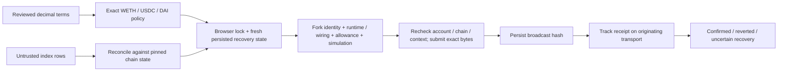

# Ophis OTC expanded security review — 2026-09-06

The expanded review found and fixed a cross-tab transaction-recovery bug and two read-validation gaps. No additional exploitable issue was established in the reviewed OTC paths. This is a bounded review, not a guarantee of security or a claim that every available skill/tool completed.

## Scope and provenance

- Baseline: Ophis `b3bb8dda78cd0e402da176b0a0de77aed2b60ed7`, the merged Milestone C implementation from [PR #1229](https://github.com/ophis-fi/ophis/pull/1229).
- Cross-tab fix: `35f903b50331156eefd2713c7b5ab3e52cfe6888`, [PR #1307](https://github.com/ophis-fi/ophis/pull/1307). Parser fixes and deterministic properties accompany this report.
- Frontend: OTC readers, parsers, pages, policy, allowance/preflight/simulation, both wallet adapters, receipt/recovery state, their immediate shared dependencies and release gates. Semgrep scope expands to 495 files; the fresh CodeQL database also covers surrounding repository code.
- Contract source: [ETHCF/swapboard at 7042b1b82defec0eecc4fce668df0fa815e8cc47](https://github.com/ETHCF/swapboard/tree/7042b1b82defec0eecc4fce668df0fa815e8cc47), inspected and tested in an isolated checkout. Forge-std pinned at `1801b0541f4fda118a10798fd3486bb7051c5dd6`; OpenZeppelin at `fcbae5394ae8ad52d8e580a3477db99814b9d565`.
- Ethereum board: `0x000000fF3D7A2d373615141d7489Ca66683DbecF`; expected runtime hash `0x8d9ad2a9d3b3d47aaa832ecc21de8775509764409ab07cdf097640396d10eda1`. The local fork checks actual deployed runtime and WETH wiring. This campaign did not reproduce deployment bytecode from compiler output.
- Network use: public, keyless `ethereum-rpc.publicnode.com` for read-only fork setup, zero fork retries and finite process limits. All transaction execution was on disposable local EVMs. Production OTC writes remain disabled.

## Confirmed findings and fixes

| ID | Severity and condition | Root cause / fix | Evidence |
| --- | --- | --- | --- |
| OTC-E01 | P2, fork write mode: an already-open tab loses another tab's broadcast warning, allowing a duplicate retry after reload | Isolated Jotai stores overwrote the same persisted map. Native exclusive Web Locks now cover submission and manual recovery; persistence is refreshed inside the lock, storage changes are subscribed, unavailable coordination fails closed. Recovery verifies fork origin and removes only the acknowledged hash. | Original cross-tab regression failed; cross-store and hook tests now cover delayed events, concurrent operations, stale retries and stale acknowledgements. |
| OTC-E02 | P3, malformed remote data: read-side amounts exceeded the documented uint256 range | Decoded amounts and indexed decimal strings accepted arbitrary nonnegative BigInts. Both now reject values above uint256; indexed strings are bounded before BigInt conversion. Existing write builders already rejected overflow. | Boundary tests accept uint256 maximum and reject maximum + 1, negative and 10,000-digit indexed values. |
| OTC-E03 | P3, inconsistent discovery: duplicate indexed IDs could produce contradictory reconciliation/enrichment, and an oversized page was accepted | Reject duplicate parsed order IDs, including `1` versus `01`, and responses above the requested 1,000-row limit. Malformed individual rows remain counted and dropped. | Duplicate-ID regression and 1,000/1,001-row boundary tests. This bounds processed rows, not raw HTTP response bytes. |

The global browser lock deliberately serializes fork OTC operations per origin. It does not coordinate different browser profiles/devices or tabs still running older application code. Reload old fork tabs before relying on the new coordination behavior. Clearing browser storage also removes recovery history.

## Trust boundaries and specification alignment

| Requirement | Implementation and review result |
| --- | --- |
| Read data never authorizes settlement | Index rows only discover/enrich; order terms, activity, runtime and wiring are re-read from the contract. Fork-order reads have finite timeout and retry UI. |
| No floating-point amount conversion | Human decimals become bounded BigInts; deterministic round trips cover 0, 6 and 18 decimals, including maximum uint256. |
| Every submission respects token policy | All seven intent kinds check both token legs; only WETH, USDC and DAI are reviewed. Unsupported tokens and native sentinels fail before encoding/submission. |
| Exact user intent reaches the wallet | Seven intent encodings are decoded and compared to reviewed fields; account, target, calldata, kind, chain and nonzero-value mutations are rejected. |
| No production write escape | Read flag, write flag, local environment and fork build mode are all required; chain-id-1 alone is insufficient. Fresh Anvil/Hardhat identity, pinned runtime/wiring and simulation are also required. |
| Approval / recovery safety | Exact allowance is required; mismatched allowance is revoked, refreshes are bounded, and a raced fill preserves recovery. Unknown receipts retain the originating fork/account/intent lock. |
| Replacement and lifecycle safety | Repriced transactions reconcile the replacement receipt; other unresolved replacements retain uncertainty. Confirmed actions become terminal; context changes prevent stale UI results. Existing regression coverage retained. |
| Stable React state | Object-returning submission/controller hooks remain memoized, callbacks remain stable, and ordinary allowance polling does not recreate submission callbacks. |

## Contract entry points and token assumptions

| Contract entry | Authorization / external interaction | OTC exposure |
| --- | --- | --- |
| `createOrder` | Permissionless maker; nonReentrant; validate addresses/amounts/code, transfer token A and verify exact escrow balance delta | ERC-20 create |
| `fillOrder` | Permissionless taker; nonReentrant; deadline/activity checks, deactivate, transfer B to maker and A to taker atomically | ERC-20 fill with a fresh nonzero deadline |
| `cancelOrder` | Maker only; nonReentrant; deactivate and return token A atomically | ERC-20 cancel |
| Four ETH wrappers | nonReentrant; immutable WETH and checked ETH transfers/value constraints | Disabled in this milestone |
| `receive` | Accepts ordinary ETH transfers only from WETH | No frontend write path |

The contract has no administrator, proxy or upgrade entry point. Exact token-A deposit accounting rejects under-receipt. Token-B fee-on-transfer/rebase semantics would still violate a general arbitrary-token integration; the frontend's fixed reviewed token policy is essential. USDC/DAI administrative changes, pauses/blocklists and future token upgrades remain external escrow-availability risks. Local fuzz mocks do not model those issuer behaviors. Slither generated inheritance and entry-point/authorization output; its eight raw findings were triaged as described below.

## Executed checks

| Check | Result / limits |
| --- | --- |
| Focused Jest suite | 39 suites, 275 passing tests; one optional network test skipped, with the dedicated seven-test contract fork suite executed separately. |
| Deterministic properties | Seed `ophis-otc-serialization-2026-09-06`: 264 uint256 samples, 1,848 intent encodings and 14,784 single-field/calldata mutations; decimal, token-policy and parser-boundary checks pass. |
| Frontend typecheck / scoped ESLint | Pass. No new dependency, blanket lint suppression or oversized production source file introduced. |
| Actual deployed-contract fork tests | 7 pass, 0 fail, 0 skip: runtime/wiring/token identity, exact create/fill/cancel, expired deadline, competing fill and late cancellation, missing approval. |
| Injected-wallet browser | Instrumented rerun: 6 pass, 0 skip, 1m45s; 24 local receipts captured, all successful. First run: 5 pass, one USDC approval reverted. Its cause was not established; the instrumented rerun did not reproduce it. The independent [PR #1307 browser/contract CI gate](https://github.com/ophis-fi/ophis/actions/runs/34033424064) also passed. |
| Upstream Foundry invariants | 15 pass: seven stateless properties at 1,024 runs each; eight stateful checks at 256 runs × depth 128, seed `0x20260906`. Six stateful assertions are substantive; two are logging/uint sanity checks. Handler exercised create/fill/cancel with no reverts/discards in the reported campaign. |
| Echidna stateless | Existing upstream seven Foundry-style properties, seed `20260906`, 10,001 calls; pass. No new Solidity harness needed. |
| Echidna stateful | Six substantive accounting properties, seed `20260906`, 20,233 calls, depth 128; pass. Explicit ABI filters include handler create/fill/cancel and six invariants. Saved corpus and source coverage confirm all three mutation paths executed. |
| Slither | 9 contracts, 101 detectors, 8 raw findings; no actionable OTC contract finding established. Inheritance/function/authorization reports generated. |
| CodeQL | Official security-extended plus GitHub Security Lab community JavaScript queries; custom RPC source models validated by actual OTC flow-source rows. Fresh DB: 4,031/4,032 JS/TS files and 29/29 Actions analyzed, 25 raw findings, none located in OTC sources. 96 OTC files match the source archive exactly; five test-only import/type edits followed extraction. |
| Semgrep OSS | 13 packs, up to 495 files; security-audit, secrets, JavaScript, TypeScript, Node, React, insecure-transport, GitHub Actions, OWASP top ten, CWE top 25, Trail of Bits, elttam and Apiiro. Raw findings and embedded-Bash parsing warnings are retained, not reported as zero. Pro/cross-file Semgrep was unavailable; CodeQL supplied interprocedural analysis. |
| Gitleaks | Scoped Git scan: zero. Source snapshot: 15 generic-key matches, all public addresses/calldata in tests; no actual credential established. |
| Dependency / configuration review | Frontend audit reported 20 vulnerable package instances: 1 high, 15 moderate, 4 low. Existing dependency advisories are not claimed resolved by this OTC patch. See reachability notes below. |
| Release gate self-tests | Fork-scope and exact-head Codex-review parser self-tests pass. No mainnet-funded wallet, secret RPC or gate bypass used. |

The first Echidna stateful attempt only exercised invariant getters. A second filter-only run selected zero properties. Both were discarded as inadequate evidence; only the final run with mutation coverage and six selected properties counts above.

## Static findings triage

- Slither: one low-severity native-create reentrancy pattern is protected by the transient reentrancy guard and immutable WETH; native paths are not enabled here. Three timestamp findings are intentional deadline comparisons. Two assembly findings are checked native transfers; the remaining findings concern pragma constraints and immutable naming. None establishes an exploit in the allowed ERC-20 path.
- Semgrep: the two unique shell-injection matches refer to GitHub-owned event/schedule strings in the pre-existing Optimism monitor, not attacker-supplied PR fields. Apiiro's five matches are three descriptive Cosmos fixture names and two static inline image assets. Eighteen unique warnings concern Bash snippets inside six existing workflow YAML files; those snippets were inspected, but the affected rules' parse coverage remains incomplete. One incompatible third-party obfuscation rule was excluded by the scanner configuration.
- CodeQL: seven test URL-regex warnings, three shared numeric-regex warnings, three non-OTC request-forgery leads, a non-OTC CLI condition, two widget-cache leads, seven unpinned actions under vendored/nested workflow directories and one legacy local backend configuration. OTC uses its own bounded numeric parser. Widget replay preserves origin/source and the eventual listener verifies them; cache-map hardening remains a separate shared-widget concern. Nested workflows are not top-level Ophis Actions. These results are not a clean bill of health for unrelated services or shared utilities.
- CI also flagged `new StorageEvent(type, options)` in the regression test. The [standard constructor accepts that dictionary](https://developer.mozilla.org/en-US/docs/Web/API/StorageEvent/StorageEvent), and the test verifies its effect. This is an outdated CodeQL extern-model warning, not a reason to replace the native API.
- Dependency reachability: high-severity `ip` is in Trezor's Node SOCKS stack; no OTC SSRF path was established. The current `qs` caller serializes fixed CMS query data rather than parsing attacker-controlled comma arrays or objects. WalletConnect's transitive `decode-uri-component` advisory remains relevant to wallet integration availability and needs separate dependency remediation; an OTC-triggered exploit was not established. Build tooling, Explorer Web3 and unrelated packages account for the remaining advisory families. References: [decode-uri-component](https://github.com/advisories/GHSA-vcc3-ghjq-m6fr), [qs comma-array limits](https://github.com/advisories/GHSA-x5fp-wj9c-mxmx), [qs object parsing](https://github.com/advisories/GHSA-4mjr-xmp4-gh2g).
- Passive production headers include HSTS, CSP, nosniff and a restrictive permissions policy. CSP retains broad HTTPS/frame permissions and eval compatibility for the host application; this review did not establish a production OTC write bypass through them.

## Skills used and work not completed

| Skill / workflow | Actual use |
| --- | --- |
| audit-context-building; differential-review | Traced OTC inputs, storage, policy, submission and recovery; compared the reviewed baseline and fixes. Applied to this bounded scope, not every repository line. |
| variant-analysis; sharp-edges; insecure-defaults | Checked sibling sinks/adapters, cross-tab/fork transitions, transport keys, fail-closed flags, recovery and parser variants. |
| property-based-testing; spec-to-code-compliance | Deterministic serialization/mutation properties and the requirement-to-implementation mapping above. Adapted review, not a formal proof of the full specification. |
| semgrep; codeql; sarif-parsing | Executed the reported scans, validated extraction/models, and triaged raw outputs. Engine/parse limitations are explicit. |
| secure-workflow-guide; entry-point-analyzer | Reviewed state-changing contract entries, authorization, external calls and invariant evidence; Slither reports generated. |
| token-integration-analyzer; security; smart-contract-auditor | Reviewed exact-transfer assumptions, token allowlist, conservation, settlement finality, native exclusions and issuer risks. Applied source-review methods rather than claiming every checklist phase completed. |
| security-hardening | Reviewed storage coordination, untrusted responses, dependency findings, headers and release controls. |
| audit / solidity-auditor / Fizz | These full orchestration workflows did **not** complete. One delegated contract-audit task was rejected by an automatic security filter and was not retried. Other delegated work hit an agent usage limit; the root agent finished the permitted source review, fixes and tests locally. No claim of a completed Pashov 12-specialist audit or Fizz-generated campaign. |
| Other engines / unrelated skills | Medusa, Halmos, Manticore, a full formal verification pass and unrelated-chain/memory-safety scanners were not run. Installed tools and read skill files do not count as completed audits. |

## Reproduction and evidence

Run frontend checks from `apps/frontend`: `NX_DAEMON=false pnpm typecheck`, scoped `pnpm exec eslint` on changed TS/TSX files, and `pnpm exec jest --config apps/cowswap-frontend/jest.config.ts --runInBand --testPathPatterns 'src/(ophis/otc|pages/Otc|entities/otc|modules/application/containers/App/menuConsts)'`.

Contract fork command from `contracts`: `FOUNDRY_PROFILE=otc-fork timeout 180 forge test --fork-url https://ethereum-rpc.publicnode.com --fork-retries 0 --match-path test/otc-fork/OtcSwapboardEthereumFork.t.sol -vv`.

Upstream campaign commands from the pinned checkout's `contracts`: `FOUNDRY_FUZZ_RUNS=1024 FOUNDRY_INVARIANT_RUNS=256 FOUNDRY_INVARIANT_DEPTH=128 timeout 300 forge test --match-path 'test/invariant/*.t.sol' --fuzz-seed 0x20260906 -vv`; `echidna . --contract SwapboardStatelessInvariantTest --test-mode foundry --test-limit 10000 --seq-len 1 --seed 20260906 --workers 2 --timeout 120 --format text --crytic-args '--foundry-compile-all'`. Stateful Echidna uses the archived filter config, contract `SwapboardInvariantTest`, limit 20000 and sequence length 128.

Raw logs, SARIF, detector output, source-scope checks, Echidna filter/corpus coverage and browser receipts are retained locally in `/Users/scep/ophis-audit-evidence/2026-09-06/`. [PR #1307](https://github.com/ophis-fi/ophis/pull/1307) merged as `d91b78bb98664876486b604c3b5e08eca01b16ba` after all required CI and a [clean exact-head Codex review](https://github.com/ophis-fi/ophis/pull/1307#issuecomment-5559261453). The parser PR records its own release status, required CI and final-head review; this report does not substitute for those gates.
