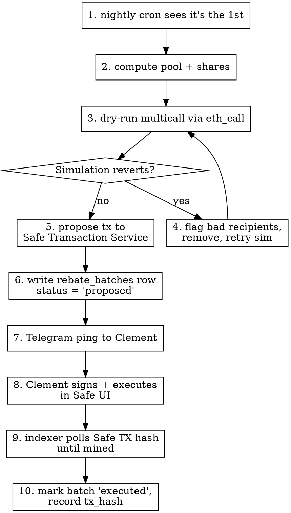

# Ophis Rebate Ledger — Design

**Status:** Approved, ready for implementation plan
**Author:** Clement
**Date:** 2026-05-11
**Related:** Phase 4 (sovereign orderbook) — Phase boundary in §7

---

## Summary

A volume-tiered WETH rebate program that turns Ophis's existing 25% price-improvement partner-fee revenue into a marketable retention loop. Every trade routed through ophis.fi accrues partner-fee WETH to the Ophis Safe on Gnosis Chain. Once a month, an off-chain indexer reads 30-day per-wallet swap volume from the CoW orderbook API, assigns each wallet to a discrete tier (Bronze / Silver / Gold / Platinum), computes weighted shares of a configurable 50% of the Safe's WETH balance, and queues a single MultiSend transaction in the Safe Transaction Service for human-confirmed execution. A swap-page chip surfaces each user's current tier and progress to the next, driving the "swap more, earn more" narrative.

## Goals & non-goals

**Goals.**
- Turn a silent revenue mechanic into a visible user incentive.
- Pay scaling rebates without committing to a fixed marketing budget.
- Keep the rebate computation publicly auditable (open-source code, public CoW API, public Safe transactions).
- Ship in 1–2 weeks. Defer everything that doesn't pass that bar.

**Non-goals (v1).**
- On-chain `GPv2Settlement` event indexing (Phase 2 — see §7).
- Multi-chain Safe execution. Phase 1 pays from the Gnosis Safe only.
- A user-visible rebate *history* page beyond the current-tier chip.
- Runtime tier-table editor. `src/tiers.ts` is a code-and-deploy change.
- Anti-Sybil heuristics. Splitting volume across wallets hurts the user via tier cliffs.
- Sub-monthly payout cadences.

## Architecture overview

```
                ┌──────────────────────────────────┐
                │   CoW orderbook API (10 chains)  │
                │   api.cow.fi/{chain}/v1/trades   │
                └──────────────────┬───────────────┘
                                   │ nightly cron 02:00 UTC
                                   ▼
   ┌──────────────────────────────────────────────────────────┐
   │                  Aleph VM: rebate-indexer                │
   │  ┌────────────────────────────────────────────────────┐  │
   │  │ 1. fetcher.ts   pulls new trades by appCode=ophis  │  │
   │  │ 2. pricer.ts    enriches w/ USD via /quote         │  │
   │  │ 3. scorer.ts    computes per-wallet 30d volume     │  │
   │  │ 4. tierer.ts    maps volume → tier → rebate %      │  │
   │  │ 5. batcher.ts   builds Safe multicall (monthly)    │  │
   │  └────────────────────────────────────────────────────┘  │
   │  Postgres 16:  trades  |  wallets  |  rebate_batches    │
   │  HTTP API:     GET /tier/:wallet → { tier, vol, next }  │
   └──────────────────────────────────────────────────────────┘
                │                                  │
                │ /tier/:wallet (CORS-allowed)     │ Safe TX proposal
                ▼                                  ▼
   ┌──────────────────────────┐       ┌──────────────────────────┐
   │ ophis.fi swap-page chip  │       │ Safe Transaction Service │
   │ "Silver • $12.4k •       │       │ queue → Clement signs    │
   │  $37.6k to Gold"         │       │ → batch WETH transfers   │
   │                          │       │ → on-chain execution     │
   └──────────────────────────┘       └──────────────────────────┘
```

**Single service, single DB, two outputs:** a public read-only API powering the swap-page tier chip, and a monthly Safe transaction proposal that pays out WETH to N wallets in one atomic multicall.

**Trust boundary.** The indexer is the source of truth for who is owed what. Its computation is reproducible — any user can fork the code and replay against the same CoW API to verify their own rebate. Final execution still requires a human-signed Safe transaction, so a compromised indexer can propose but not execute drains.

## Components

Five TypeScript modules in a single Aleph VM service. Each has one job, talks via Postgres, can be tested in isolation.

**Repo placement:** `apps/rebate-indexer/` — new pnpm workspace package, sibling to `apps/frontend` and `apps/backend`.

```
apps/rebate-indexer/
├── src/
│   ├── fetcher.ts      ─┐
│   ├── pricer.ts        │  cron job entrypoints
│   ├── scorer.ts        │  (run sequentially nightly)
│   ├── tierer.ts        │
│   ├── batcher.ts      ─┘  (monthly only)
│   ├── api.ts              HTTP server (GET /tier/:wallet, GET /health, GET /status, GET /batches)
│   ├── db.ts               postgres-js client + migrations
│   ├── tiers.ts            tier table constants (source of truth)
│   └── cli.ts              one-off ops commands (replay, simulate-batch, rotate-proposer)
├── migrations/
├── tests/
├── docker-compose.yml      pg + indexer + caddy
├── Dockerfile
├── RUNBOOK.md
└── package.json
```

| Module | What it does | Depends on | Output |
|---|---|---|---|
| `fetcher.ts` | Page through CoW `/v1/trades?app_data_hash=…` per chain; upsert new trades into `trades` | CoW API, `db` | rows in `trades` (raw, no USD yet) |
| `pricer.ts` | For each unpriced trade, call CoW `/quote` at the trade's block; store USD value | CoW API, `db` | `trades.value_usd` populated |
| `scorer.ts` | Refresh materialized view aggregating 30d volume per wallet | `db` | `wallets.volume_30d_usd` |
| `tierer.ts` | Apply `tiers.ts` table to volume → tier + rebate %; write to `wallets` | `db`, `tiers` | `wallets.tier`, `wallets.rebate_pct` |
| `batcher.ts` | Once per month: read Safe's WETH balance, compute weighted shares, build multicall, propose to Safe TX Service | `db`, Safe TX Service, viem | Safe proposal hash |
| `api.ts` | Fastify HTTP server for the swap-page chip and public status endpoints | `db` | JSON |

**Shared infra:**
- **DB:** Postgres 16 on the same Aleph VM (single-tenant, ~15 MB/year expected).
- **Reverse proxy:** Caddy fronting the HTTP API at `rebates.ophis.fi` with auto-TLS.
- **Secrets:** Aleph VM env vars; Safe proposer key in `SAFE_PROPOSER_PRIVATE_KEY`, sourced from macOS Keychain entry `ophis-rebate-proposer` at deploy time.
- **Idempotency:** every cron job is replayable — UPSERT on `trade_uid`, UNIQUE on `rebate_batches.cycle_month`.

**Why a single Postgres + module split, not microservices.** At 10 chains × tens of trades/day initially, one Postgres + sequential cron is dramatically simpler than Kafka/Redis Streams. The five modules are cheap to refactor into separate services later if any one becomes a bottleneck.

## Data model

Three tables. One materialized view. Everything is replayable from `trades` alone — `wallets` and `rebate_batches` are derived state.

```sql
-- migrations/001_init.sql

-- ─────────────────────────────────────────────────────────────
-- trades: one row per settled CoW trade tagged appCode = "ophis"
-- ─────────────────────────────────────────────────────────────
CREATE TABLE trades (
  trade_uid          BYTEA       PRIMARY KEY,    -- 56-byte CoW order UID
  chain_id           INTEGER     NOT NULL,
  wallet             BYTEA       NOT NULL,       -- 20-byte EOA (order.owner)
  block_number       BIGINT      NOT NULL,
  block_timestamp    TIMESTAMPTZ NOT NULL,       -- the rebate clock starts here

  sell_token         BYTEA       NOT NULL,
  buy_token          BYTEA       NOT NULL,
  sell_amount        NUMERIC(78) NOT NULL,       -- raw uint256
  buy_amount         NUMERIC(78) NOT NULL,

  app_code           TEXT        NOT NULL,       -- "ophis" expected, "greg" tolerated for pre-rebrand
  partner_fee_wei    NUMERIC(78),                -- Ophis's net cut (after CoW DAO's 25%)

  value_usd          NUMERIC(20,4),              -- NULL until pricer enriches it
  priced_at          TIMESTAMPTZ,

  fetched_at         TIMESTAMPTZ NOT NULL DEFAULT now()
);
CREATE INDEX trades_wallet_time_idx ON trades (wallet, block_timestamp DESC);
CREATE INDEX trades_unpriced_idx    ON trades (priced_at) WHERE value_usd IS NULL;

-- ─────────────────────────────────────────────────────────────
-- wallets: derived rolling 30d view, refreshed nightly
-- ─────────────────────────────────────────────────────────────
CREATE MATERIALIZED VIEW wallets AS
SELECT
  wallet,
  SUM(value_usd)                            AS volume_30d_usd,
  COUNT(*)                                  AS trade_count_30d,
  MAX(block_timestamp)                      AS last_trade_at
FROM trades
WHERE block_timestamp > now() - INTERVAL '30 days'
  AND value_usd IS NOT NULL
GROUP BY wallet;
CREATE UNIQUE INDEX wallets_pk ON wallets (wallet);

-- ─────────────────────────────────────────────────────────────
-- rebate_batches: one row per monthly payout cycle
-- ─────────────────────────────────────────────────────────────
CREATE TABLE rebate_batches (
  id                 SERIAL      PRIMARY KEY,
  cycle_month        DATE        NOT NULL UNIQUE,        -- 2026-06-01 = May 2026 cycle
  net_fee_weth_wei   NUMERIC(78) NOT NULL,               -- Safe's WETH balance snapshot
  pool_weth_wei      NUMERIC(78) NOT NULL,               -- 50% of above (configurable)

  safe_proposal_hash BYTEA,                              -- NULL until proposed
  safe_tx_hash       BYTEA,                              -- NULL until executed
  status             TEXT        NOT NULL DEFAULT 'computing',
                                                         -- computing | proposed | executed | failed | no_recipients
  proposed_at        TIMESTAMPTZ,
  executed_at        TIMESTAMPTZ,
  created_at         TIMESTAMPTZ NOT NULL DEFAULT now()
);

-- ─────────────────────────────────────────────────────────────
-- rebate_batch_entries: per-wallet payout inside a batch
-- ─────────────────────────────────────────────────────────────
CREATE TABLE rebate_batch_entries (
  batch_id           INTEGER     NOT NULL REFERENCES rebate_batches(id),
  wallet             BYTEA       NOT NULL,
  volume_30d_usd     NUMERIC(20,4) NOT NULL,             -- snapshot at compute time
  tier               TEXT        NOT NULL,               -- "bronze" | "silver" | "gold" | "platinum"
  rebate_pct         NUMERIC(5,4) NOT NULL,              -- 0.1000 = 10%
  weth_amount_wei    NUMERIC(78) NOT NULL,
  PRIMARY KEY (batch_id, wallet)
);
CREATE INDEX rebate_entries_wallet_idx ON rebate_batch_entries (wallet);
```

**Key design choices.**

| Decision | Reason |
|---|---|
| `trade_uid` as PK | CoW's order UID is globally unique across chains; natural idempotency on re-fetch. |
| `NUMERIC(78)` for raw amounts | Lossless uint256 storage; never lose precision to JS Number. |
| `value_usd` nullable | Decouples ingestion from pricing; fetcher runs even if `/quote` is down. |
| Materialized view for `wallets` | `REFRESH MATERIALIZED VIEW CONCURRENTLY` is atomic; API stays fast and consistent. |
| `cycle_month UNIQUE` | Prevents double-payout under indexer bugs. |
| `app_code` stored, not filtered | Future-proofs analytics ("how much was pre-rebrand?"); fetcher filters on ingest. |
| Per-wallet entries in their own table | Audit trail per user; supports a future "/my-rebates" page without schema changes. |

**Storage projection.** 100 trades/day × 365 days = ~36k rows/year × ~400 bytes ≈ **15 MB/year**. Sub-200 MB lifetime even at 10× initial volume.

**Reproducibility.** Drop `wallets` + `rebate_batches`, re-run `fetcher` + `pricer` + `scorer` + `tierer` → identical results. Any user can fork the indexer and verify their own historical tier assignments.

## Volume → Tier → Rebate math

### Tier table (single source of truth)

```ts
// src/tiers.ts — imported by indexer AND swap-page chip via @ophis/sdk
export const TIERS = [
  { name: 'bronze',   min_usd:      0, rebate_pct: 0.10 },
  { name: 'silver',   min_usd:  5_000, rebate_pct: 0.20 },
  { name: 'gold',     min_usd: 50_000, rebate_pct: 0.35 },
  { name: 'platinum', min_usd: 500_000, rebate_pct: 0.50 },
] as const;

export const POOL_SPLIT_BPS = 5_000; // 50% of net partner-fee → rebate pool
```

### Volume aggregation

Per-wallet 30d USD volume comes from the `wallets` materialized view (defined in §Data model). Refreshed once per night after `pricer` completes.

### Tier assignment

```ts
function assignTier(volume_30d_usd: number): { tier: string; rebate_pct: number } {
  for (let i = TIERS.length - 1; i >= 0; i--) {
    if (volume_30d_usd >= TIERS[i].min_usd) return TIERS[i];
  }
  return TIERS[0]; // unreachable; bronze has min 0
}
```

Unit-test exhaustively against boundary values: `4_999.99 → bronze`, `5_000.00 → silver`, etc.

### Monthly rebate computation (weighted-share algorithm)

```ts
// 1. Snapshot the pool size
const pool_wei = (safe_weth_balance_wei * POOL_SPLIT_BPS) / 10_000n;

// 2. Compute each wallet's weighted share
//    weight_i = volume_i × rebate_pct_i
//    share_i  = pool × (weight_i / Σ weights)
let total_weight = 0n;
const weights: Map<wallet, bigint> = new Map();
for (const w of eligible_wallets) {
  const { rebate_pct } = assignTier(w.volume_30d_usd);
  const volume_fp = BigInt(Math.round(w.volume_30d_usd * 10_000));
  const pct_fp    = BigInt(Math.round(rebate_pct * 10_000));
  const weight    = volume_fp * pct_fp;
  weights.set(w.wallet, weight);
  total_weight += weight;
}

// 3. Distribute pool proportionally
//    Σ shares ≤ pool_wei (floor dust stays in Safe, rolls forward to next cycle)
const shares: Map<wallet, bigint> = new Map();
for (const [wallet, weight] of weights) {
  if (weight === 0n) continue;
  const share = (pool_wei * weight) / total_weight;
  if (share > 0n) shares.set(wallet, share);
}
```

**Worked example.** Three users this cycle:

| Wallet | 30d volume | Tier | rebate % | weight (vol × pct) |
|---|---|---|---|---|
| Alice | $80,000 | Gold | 35% | 28,000 |
| Bob | $10,000 | Silver | 20% | 2,000 |
| Carol | $600,000 | Platinum | 50% | 300,000 |
| **Σ** | | | | **330,000** |

Safe holds **0.4 WETH** at month-end. Pool = 50% = **0.2 WETH**.

| Wallet | weight share | WETH payout |
|---|---|---|
| Alice | 28,000 / 330,000 = 8.48% | 0.01697 WETH |
| Bob | 2,000 / 330,000 = 0.61% | 0.00121 WETH |
| Carol | 300,000 / 330,000 = 90.91% | 0.18182 WETH |
| **Σ** | 100% | 0.20000 WETH |

**Properties.**

1. **Pool is bounded.** Total distribution = exactly `pool_wei` (modulo floor dust, which rolls forward to next cycle in the Safe).
2. **Tier % is a multiplier, not an absolute rebate.** Two Gold wallets with 2× volume → the bigger one gets 2× the WETH. The tier table determines relative weight.
3. **Self-balancing under low usage.** Slow month with one user → they get the whole pool. Busy month with many high-tier users → everyone's share shrinks proportionally.
4. **No claim mechanism.** Eligible = had any rebated trade in the last 30 days. Payout is push.

**Edge cases.**
- Single eligible wallet → 100% of pool, regardless of tier.
- Zero eligible wallets → `rebate_batches.status = 'no_recipients'`, no proposal.
- Floor dust (Σ shares < pool) → stays in Safe, increases next cycle.
- A trade priced after the batch ran → contributes to next cycle. Paid batches are never retroactively adjusted.

## Safe batch flow

Three actors:
- **Aleph VM indexer** — holds the proposer key; can only queue transactions.
- **Safe Transaction Service** — Safe's hosted indexing+queue service at `https://safe-transaction-gnosis-chain.safe.global`.
- **Clement (signer)** — holds the signer key in Rabby/Frame; logs into Safe UI to execute.

The Safe is currently **1-of-1** with owner `0x0494…d1A`. This flow is designed to remain correct after the **O1 upgrade to 2-of-N**: the proposer key becomes a non-owner key with proposer-only rights; execution requires N signatures from human-held owner keys.

### Why Gnosis Chain only (Phase 1)

CoW DAO pays partner-fee accruals as WETH on Gnosis Chain. The Safe is CREATE2-deterministic — `0x858f…CeF8` exists on all 10 CoW chains — but only the Gnosis address holds WETH unless we bridge. So Phase 1 = single-chain execution on Gnosis.

### Transaction shape: one Multicall, N transfers

We queue **one** transaction calling Safe MultiSend v1.4.1 (`0x40A2aCCbd92BCA938b02010E17A5b8929b49130D`), which internally executes N `WETH.transfer(wallet, amount)` calls atomically via DELEGATECALL. Atomic = if any transfer reverts, the entire batch reverts and no one is paid. See step 4 below for the quarantine mitigation.

### End-to-end flow



**Step-by-step.**

1. **Cron trigger.** A single 02:00 UTC daily cron runs the full pipeline in-process and in sequence: `fetcher → pricer → scorer → tierer`. On the 1st of the month, `batcher` runs as the final step of that chain — never as a separate cron tick, so there is no race between nightly aggregation and monthly payout.

2. **Compute shares.** Section "Volume → Tier → Rebate" logic. Snapshot `wallets` view, calculate pool + per-wallet WETH amounts.

3. **Dry-run via `eth_call`.** Before proposing, simulate the multicall locally:
   ```ts
   await publicClient.simulateContract({
     account: SAFE_ADDRESS,
     address: MULTISEND_ADDRESS,
     abi: multiSendAbi,
     functionName: 'multiSend',
     args: [encodedTxs],
   });
   ```
   Catches insufficient WETH balance, a recipient contract reverting on transfer, stale Safe nonce.

4. **Recipient quarantine.** If simulation reverts, walk each transfer in isolation via `eth_call` to find the offender. Mark that wallet `is_quarantined = true` in `wallets`, exclude from this batch, retry step 3. The quarantined wallet's entry is recorded with `weth_amount_wei = 0` and a reason. They show up again next month if they make new trades from a working address.

5. **Propose to Safe Transaction Service.**
   ```ts
   import SafeApiKit from '@safe-global/api-kit';
   const safeApi = new SafeApiKit({ chainId: 100n });
   await safeApi.proposeTransaction({
     safeAddress: '0x858f…CeF8',
     safeTransactionData: { to, value, data, operation: 1, /* DELEGATECALL */ ... },
     safeTxHash,
     senderAddress: PROPOSER_EOA,
     senderSignature: await signer.signMessage(safeTxHash),
   });
   ```
   The transaction appears in the Safe UI queue under "Transactions → Queue".

6. **Persist state.** `UPDATE rebate_batches SET status='proposed', safe_proposal_hash=… WHERE id=…`. DB row is now the single source of truth for "this month is proposed but unexecuted".

7. **Telegram ping.** Send to chat `735726338` (Clement DM):
   > 💸 Rebate batch May 2026 ready to sign
   > Pool: 0.20000 WETH • 3 recipients
   > Top: 0xCarol… 0.18182 WETH (Platinum, $600k vol)
   > https://app.safe.global/transactions/queue?safe=gno:0x858f…CeF8

8. **Human confirms.** Review the batch (count, total, top recipients), sign, execute. Under 1-of-1 this is a single click. After O1's 2-of-N, it's N clicks across N devices but the proposal step is identical.

9. **Indexer polls for finality.** Every minute, query `safeApi.getTransaction(safe_proposal_hash)`. When `executed && isSuccessful`, capture `transactionHash`.

10. **Finalise.** `UPDATE rebate_batches SET status='executed', safe_tx_hash=…, executed_at=now()`. Send Telegram confirmation with the Gnosisscan link.

### Failure modes & recovery

| Failure | Detection | Recovery |
|---|---|---|
| Simulation reverts (bad recipient) | Step 3 | Step 4 quarantine + retry |
| Safe API down at propose time | `proposeTransaction` throws | `status='computing'`, retry on next cron tick |
| Clement doesn't sign within 7 days | Step 9 polling | Escalating Telegram pings on day 3, 5, 7; never auto-cancel |
| Mined tx reverts (race vs. WETH movement) | `isSuccessful = false` | Mark `status='failed'`, log, page Clement; manual investigation |
| Indexer crashes mid-flow | Process exits | On restart, resume from `status` column — idempotent at every step |
| Same month proposed twice | UNIQUE on `cycle_month` | INSERT fails fast, no double-payout |

### Proposer key management

- Generated via `cast wallet new`, stored in macOS Keychain entry `ophis-rebate-proposer` on the Mac mini.
- Pulled at deploy time, shipped to Aleph VM as env var `SAFE_PROPOSER_PRIVATE_KEY`.
- This key has **zero on-chain authority** — it's an arbitrary EOA. Safe TX Service trusts it as a proposer only because configured that way in Safe → Settings → Setup.
- If the Aleph VM is compromised, attacker can propose junk batches → human ignores them in the UI. They cannot execute.
- Rotation: `cli.ts rotate-proposer --new-key 0x…`, then update Safe settings.

### O1 (2-of-N upgrade) compatibility

Nothing in this flow changes when the Safe moves to 2-of-N. The proposer key still proposes, the queue still holds the tx, just N signatures are now required before "Execute" lights up. The indexer never needs to know the signer count.

## Operational concerns

### Deployment target

New Aleph VM, sibling to existing three (postiz-stuart, mcp-services, allo.3615crypto). Subdomain `rebates.3615crypto.com` internally → Cloudflare Tunnel → public `rebates.ophis.fi`. Matches the existing pattern.

### Compose stack

Single `docker-compose.yml` with three services:

```yaml
services:
  pg:
    image: postgres:16-alpine
    volumes: [pg_data:/var/lib/postgresql/data]
    healthcheck: { test: ["CMD", "pg_isready"], interval: 10s }

  indexer:
    build: .
    depends_on: { pg: { condition: service_healthy } }
    environment:
      DATABASE_URL: postgres://…
      SAFE_PROPOSER_PRIVATE_KEY: ${SAFE_PROPOSER_PRIVATE_KEY}
      COW_API_BASE: https://api.cow.fi
    restart: unless-stopped

  caddy:
    image: caddy:2-alpine
    ports: ["443:443", "80:80"]
    volumes: [./Caddyfile:/etc/caddy/Caddyfile, caddy_data:/data]
```

**Why in-process cron (node-cron) instead of host cron / k8s CronJobs:**
- Single deployment unit.
- Shared in-memory DB pool — no per-tick spawn cost.
- Crash visibility — same container's logs and restart policy handle it.
- Phase boundary: trivial to extract to systemd timers later if cross-VM coordination becomes a need.

### Deploy pipeline

GitHub Actions on push to `main`: build Docker image → push to Aleph image registry → SSH into VM → `docker compose pull && docker compose up -d`. Migrations run on container start (idempotent). Health check at `/health` returns `{ db, last_fetch, pending_batches }`.

### Observability

Four layers, each owned by a different consumer:

| Layer | What | Where | Audience |
|---|---|---|---|
| Structured logs | Every cron tick, every API request, every Safe TX action | `docker logs`, `journalctl` | Operator during incidents |
| DB-as-dashboard | `SELECT * FROM rebate_batches ORDER BY id DESC` | Postgres | Anyone with read-only psql |
| Telegram alerts | Major lifecycle events + errors | Chat `735726338` | Clement, real-time |
| Public status page | `GET /status` JSON: last batch, pool size, next batch ETA | `rebates.ophis.fi/status` | Users, for trust |

**Telegram alert ladder.**
- `✅ Nightly index complete: 47 new trades, $312k volume` — daily 02:30 UTC.
- `💸 Batch ready to sign` — monthly, 02:00 UTC on the 1st.
- `⏰ Batch unsigned for 3 days` / `5 days` / `7 days` — escalation.
- `🟢 Batch executed: 0.2 WETH to 12 wallets, tx 0x…` — within 1m of mine.
- `🚨 ALERT: fetcher failed 3 consecutive runs` — pager-grade.

No "I'm alive" heartbeats. Silence = healthy.

### Failure response runbook

Stored as `apps/rebate-indexer/RUNBOOK.md`, committed to git.

1. **Fetcher stuck:** check CoW API status; `docker compose restart indexer`. CoW retains full history, so missed trades land on next run.
2. **Pricer behind:** unpriced trades are excluded from `wallets` view automatically. Backfill: `pnpm tsx src/cli.ts replay-pricer --since 2026-05-01`.
3. **Batch never mined:** check Gnosis gas spike / nonce conflict in Safe UI. Re-execute from Safe UI; indexer auto-detects via polling.
4. **Wrong tier paid out:** the batch is final on-chain — no recall. Compute delta via `cli.ts diff-rebate --batch-id N`, manually queue a corrective transfer via Safe UI, document in incident log.
5. **Proposer key compromised:** rotate via `cli.ts rotate-proposer --new-key 0x…`, update Safe settings. Old key becomes inert because Safe rejects its proposals.

### Cost projection (12 months)

| Line | Monthly | Annual |
|---|---|---|
| Aleph VM | ~$15 | ~$180 |
| Cloudflare Tunnel (existing acct) | $0 | $0 |
| Subdomain (parent already owned) | $0 | $0 |
| CoW API calls (free public tier) | $0 | $0 |
| Gnosis Chain gas (~50k gas × 50 recipients/month) | <$0.01 | <$0.10 |
| **Total infra cost** | **~$15** | **~$180** |

Rebate pool itself = revenue-share, not net new cost.

## Testing strategy & correctness

### Testing pyramid

```
                    ┌──────────────────┐
                    │  manual replay   │   ← 1× before each prod batch
                    │  on Tenderly fork│
                    └──────────────────┘
                  ┌──────────────────────┐
                  │  e2e against         │   ← CI per-PR + nightly
                  │  Sepolia + CoW       │
                  └──────────────────────┘
              ┌──────────────────────────────┐
              │  integration: real Postgres  │   ← CI per-PR
              │  + mocked CoW + viem mock    │
              └──────────────────────────────┘
        ┌──────────────────────────────────────────┐
        │  unit: pure functions in tiers/scorer/   │   ← CI per-PR
        │  tierer/batcher (no I/O)                 │
        └──────────────────────────────────────────┘
```

### Layer 1 — Unit (fast, exhaustive)

Pure functions only. Run in <1s. Block PR merge on any failure.

- `tiers.test.ts` — exhaustive boundary tests on `assignTier` (cliff values).
- `batcher.test.ts` — property tests with `fast-check` on the weighted-share math:
  - `Σ shares ≤ pool, always`
  - `zero eligible wallets → empty shares`
  - `single eligible wallet → gets entire pool`
- `fetcher.test.ts` — snapshot tests on real CoW API JSON fixtures; dedupe by `trade_uid`; pagination cursor handling.

### Layer 2 — Integration (real Postgres)

`testcontainers` Postgres + `msw` for CoW API.

```ts
test('full nightly cycle: fetch → price → score → tier', async () => {
  // Seed CoW mock with 50 trades across 3 wallets
  // Run fetcher → assert 50 rows in trades
  // Run pricer → assert all priced
  // Refresh wallets view
  // Assert wallets shows correct volume + tier per wallet
});

test('replay idempotency', async () => {
  await fetcher.run();
  const snap1 = await db.query('SELECT * FROM trades ORDER BY trade_uid');
  await fetcher.run();
  const snap2 = await db.query('SELECT * FROM trades ORDER BY trade_uid');
  expect(snap2).toEqual(snap1);
});
```

### Layer 3 — End-to-end (Sepolia + real CoW API)

Nightly in CI and pre-release.

- A **dedicated test Safe** on Sepolia, separate from prod, owned by a CI-only burner key.
- Scripted swaps via `ophis-staging.pages.dev` tagged `appCode = "ophis-staging"` to keep test data isolated from production.
- Indexer runs against the staging app_data_hash filter only. Verifies the whole flow including a real Safe batch on Sepolia each cycle.

This is the only place we exercise the actual Safe Transaction Service API end-to-end — catches breaking changes in `@safe-global/api-kit` before they hit prod.

### Layer 4 — Manual replay on Tenderly fork (pre-batch ritual)

Before signing each monthly batch:
```bash
$ pnpm tsx src/cli.ts simulate-batch --month 2026-05 --fork-rpc $TENDERLY_FORK_URL
✓ Pool: 0.20000 WETH (50% of 0.40000)
✓ Recipients: 12
✓ Top: 0xCarol… 0.18182 WETH (Platinum)
✓ All transfers simulated successfully
✓ Final Safe balance: 0.20000 WETH (dust: 0 wei)

[Tenderly trace: https://dashboard.tenderly.co/...]
```

2 minutes per batch. Eliminates "I executed and only half the transfers worked" disasters.

### What makes this provably correct

Five anchors any user can verify independently:

1. **Code is open-source** — `apps/rebate-indexer/` in the public repo, MIT-licensed.
2. **Tier table is in code** — `src/tiers.ts` is the only place tier boundaries live; changes are public PRs.
3. **All inputs are public** — CoW's `/trades` API is open; anyone can replay against the same data.
4. **All outputs are public** — `rebate_batches` + `rebate_batch_entries` exposed via `GET /batches` and `GET /batches/:id`.
5. **On-chain finality** — every executed batch is a single Gnosis transaction whose decoded MultiSend payload is the auditable source of truth.

Skeptical user's full verification flow:
```bash
git clone github.com/ophis-fi/ophis && cd ophis/apps/rebate-indexer
docker compose up -d
pnpm tsx src/cli.ts replay-from-genesis
curl http://localhost:8080/batches | jq '.[] | {month, total_weth}'
# diff against rebates.ophis.fi/batches → identical
# diff against on-chain MultiSend tx → identical
```

### Pre-production checklist

Run before flipping the cron from disabled → enabled:

- [ ] All Layer 1 unit tests passing in CI
- [ ] All Layer 2 integration tests passing in CI
- [ ] At least one full Layer 3 e2e cycle has succeeded on Sepolia in the prior 7 days
- [ ] Safe proposer key generated, stored in macOS Keychain, deployed to Aleph VM
- [ ] Safe Transaction Service configured to accept the proposer key
- [ ] Cloudflare Tunnel mapping `rebates.ophis.fi` → Aleph VM live
- [ ] Telegram bot DMs configured to ping `735726338`
- [ ] `RUNBOOK.md` committed, linked from `/health` response
- [ ] `tiers.ts` reviewed (this is the only number that can't be wrong)
- [ ] Status page `rebates.ophis.fi/status` returns 200
- [ ] First real batch run as dry-run only (`--no-propose` flag); reviewed; real run on next cycle

## Phase boundary — what does NOT ship in P1

Deferred to keep delivery at 1–2 weeks:

- **On-chain `Settlement` event indexing.** v1 trusts CoW's orderbook API. v2 (post-Phase-4 sovereign orderbook) replaces with direct event streams.
- **Multi-chain Safe execution.** Gnosis-only payout in v1; bridging WETH to other chains is a separate decision driven by user demand.
- **Rebate history page.** The current-tier chip ships in v1; `/my-rebates` timeline is post-launch.
- **Tier table editor UI.** `tiers.ts` is a code-and-deploy change. v1 trust > v1 ergonomics.
- **Anti-Sybil heuristics.** Splitting volume across wallets hurts users via tier cliffs.
- **Sub-monthly cadences.** Weekly = 4× ops burden, marginal user benefit.

## Open questions for implementation plan

These don't need answering before coding starts, but the writing-plans phase will resolve them:

- Concrete `@ophis/sdk` package shape for sharing `tiers.ts` between indexer and frontend (re-export vs. duplicate-with-CI-diff-check).
- Cloudflare Tunnel config: shared tunnel with existing services vs. dedicated tunnel for `rebates.ophis.fi`.
- Whether to add a `cli.ts dry-run-monthly` command that runs the full batcher pipeline without proposing — useful for the pre-production checklist.
- Initial value of `POOL_SPLIT_BPS`: 5000 (50%) per design, but verify against current Safe balance to ensure first batch isn't trivially small.
